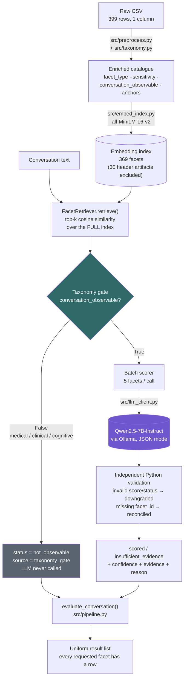
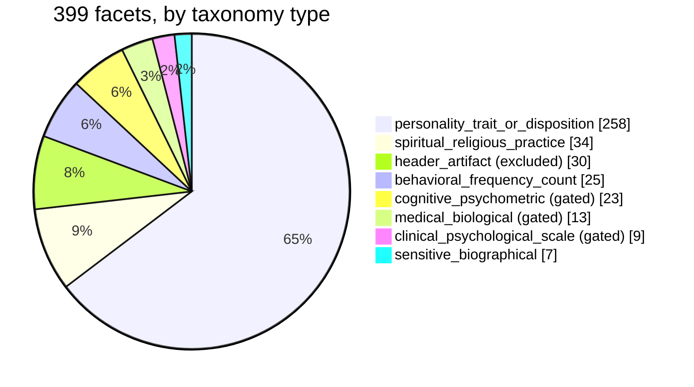
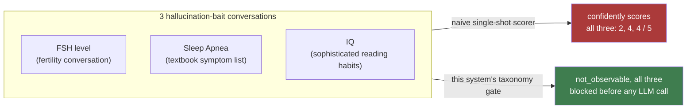
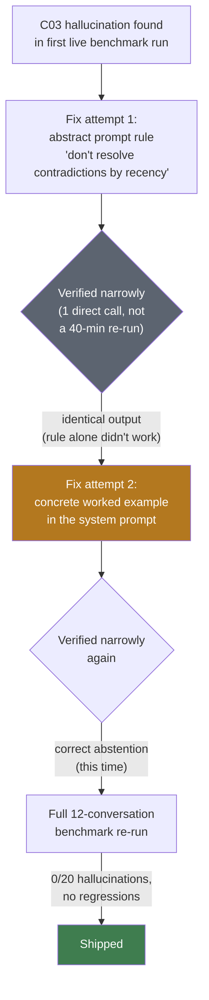
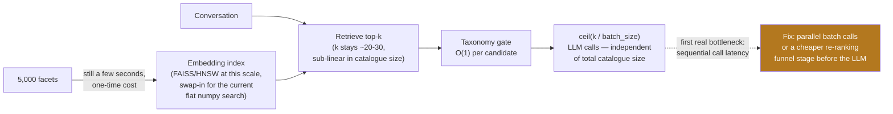

<div align="center">

# Facet Scoring Baseline

**A retrieval-gated scoring pipeline that evaluates conversations against a 399-facet catalogue — and refuses to invent a score when the evidence isn't there.**


[**Live report →**](report.html) &nbsp;·&nbsp; [Facet audit](data/processed/AUDIT_SUMMARY.md) &nbsp;·&nbsp; [Benchmark](eval/report.md) &nbsp;·&nbsp; [Hallucination demo](hallucination_demo/examples.md) &nbsp;·&nbsp; [Decisions](DECISIONS.md) &nbsp;·&nbsp; [Debug log](DEBUGGING.md) &nbsp;·&nbsp; [Prompt log](PROMPT_LOG.md)

</div>

<br>

## The problem this solves

Given 399 wildly heterogeneous "facets" — `Risktaking`, `FSH level`, `692. Astrology: Rising sign is Scorpio`, `Sleep Apnea`, `Museum visits/year` — and a short conversation, produce a defensible score for the ones the conversation actually supports, and an explicit, machine-readable refusal for the ones it doesn't.

The brief forbids the obvious shortcut: no single prompt dumping the whole catalogue at an LLM and asking for 399 scores back. And it grades you specifically on **not hallucinating** — a naive scorer will happily infer a lab value from a passing mention of "the doctor said my levels were off." This system is built so that failure mode is structurally impossible for a whole class of facets, not just discouraged by a polite prompt.

```
naive approach:  399 facets → 1 giant prompt → 399 confident-sounding numbers (some fabricated)
this system:     conversation → embedding retrieval → deterministic taxonomy gate → small LLM
                  batches → validated JSON → scores AND explicit abstentions, evidence-cited
```

<br>

## Architecture



**The load-bearing design choice:** retrieval sees the *entire* index, including facets that can never be safely scored. The taxonomy gate — a plain Python `bool` check, not a model output — sits between retrieval and the LLM and physically prevents a prompt from ever being constructed for a non-observable facet. This is why `hallucination_demo/` can show the gate blocking something embeddings *did* find relevant (e.g. `FSH level` for a fertility conversation) instead of just claiming it would.

<br>

## Quick start

```bash
pip install -r requirements.txt

# local inference server + model (Apache-2.0, 7B, fits the ≤16B constraint)
ollama serve &
ollama pull qwen2.5:7b-instruct

python src/preprocess.py            # Part 1 — audit + enrich the raw CSV
python src/embed_index.py           # build the local embedding index
python eval/run_eval.py             # Part 3 — run the benchmark, write eval/report.md
python hallucination_demo/naive_baseline.py   # naive-vs-gated contrast
python eval/retrieval_ablation.py   # embedding-format ablation (no LLM needed)

pytest tests/ -v                    # 17 tests, no LLM/network required
```

Everything under `data/processed/` is generated by these scripts — nothing there is hand-edited. Re-running `preprocess.py` on the same CSV produces byte-identical output.

<br>

## Part 1 — Facet audit: what 399 rows actually contained

The raw CSV is not clean. It mixes real personality dimensions (Big Five, HEXACO) with MMPI clinical-scale codes, lab values, numbered spiritual-practice counters with scrape artifacts, and section headers that got scraped in as if they were facets. `src/taxonomy.py` classifies every row deterministically — regex/keyword rules, zero LLM calls, fully reproducible:

```python
# src/taxonomy.py — priority-ordered, deterministic classification
def classify_facet_type(normalized_value, raw_value, is_malformed):
    if is_malformed:
        return "header_artifact"

    low = normalized_value.lower()
    if _matches_any(low, SPIRITUAL_KEYWORDS):
        return "spiritual_religious_practice"
    if _matches_any(low, CLINICAL_KEYWORDS):
        return "clinical_psychological_scale"
    if _matches_any(low, MEDICAL_BIO_KEYWORDS):
        return "medical_biological"
    if _matches_any(low, COGNITIVE_KEYWORDS):
        return "cognitive_psychometric"
    if BEHAVIORAL_COUNT_PATTERN.search(low):
        return "behavioral_frequency_count"

    return "personality_trait_or_disposition"   # default bucket
```

Each `facet_type` deterministically derives whether the facet can ever be scored from conversation, and why not if not:

```python
_TYPE_RULES = {
    "medical_biological": dict(
        conversation_observable=False, sensitivity="high",
        abstention_reason="requires_medical_lab_or_genetic_evidence",
    ),
    "clinical_psychological_scale": dict(
        conversation_observable=False, sensitivity="high",
        abstention_reason="requires_validated_clinical_instrument_or_diagnosis",
    ),
    "cognitive_psychometric": dict(
        conversation_observable=False, sensitivity="medium",
        abstention_reason="requires_formal_psychometric_testing",
    ),
    # ...spiritual/behavioral/personality types are conversation_observable=True
}
```



<details>
<summary><b>What the audit found, concretely</b></summary>

<br>

| Problem | Count | How it's handled |
|---|---|---|
| Section-header rows scraped in as facets (`"HEXACO Personality Inventory Facets:"`) | 30 (7.5%) | Detected by trailing-colon heuristic → `header_artifact`, excluded from the embedding index entirely |
| Leading `NNN. ` scrape-artifact ID prefix (`"800. Sufi practice: ..."`) | 31 | Stripped during normalization, ID preserved in its own column |
| CamelCase concatenation artifacts (`SelfEsteem`, `Selfcontrol`) | 3 | Fixed via lower→Upper boundary splitting that preserves real acronyms (`IQ`, `HEXACO`) |
| Facets requiring lab tests, clinical diagnosis, or formal psychometric testing | 45 (13+9+23) | Gated `conversation_observable=False` — blocked before any LLM call, regardless of what's said |
| Exact duplicate normalized values | 0 | Checked, not assumed |

</details>

<br>

## Part 2 — Retrieval, the taxonomy gate, and robust scoring

**Retrieval** embeds every non-header facet with `all-MiniLM-L6-v2` (local, no API) and does a flat cosine-similarity search — deliberately simple at this scale (see [Scaling to 5,000 facets](#scaling-to-5000-facets) for the upgrade path):

```python
# src/retrieve.py
def retrieve(self, conversation_text: str, top_k: int = 20) -> list[dict]:
    query_emb = self.model.encode([conversation_text], normalize_embeddings=True)[0]
    sims = self.embeddings @ query_emb            # cosine sim, both L2-normalized
    top_idx = np.argsort(-sims)[:top_k]
    return [self._facet_row_to_candidate(self.facet_ids[i], sims[i]) for i in top_idx]

@staticmethod
def split_by_taxonomy_gate(candidates):
    llm_eligible     = [c for c in candidates if c["conversation_observable"]]
    taxonomy_blocked = [c for c in candidates if not c["conversation_observable"]]
    return llm_eligible, taxonomy_blocked
```

**Scoring** batches only the `llm_eligible` facets (5 per call — see [`DEBUGGING.md` #4](DEBUGGING.md) for why not 8) through a single structured-JSON call, then **re-validates the model's output independently** rather than trusting its own "valid JSON" claim:

```python
# src/score.py — every coercion is logged, nothing fails silently
def _coerce_result_item(item, valid_facet_ids):
    ...
    if status == "scored":
        try:
            score = int(score)
            if not (1 <= score <= 5):
                raise ValueError
        except (TypeError, ValueError):
            status = "insufficient_evidence"          # never trust an out-of-range score
            note = f"invalid_score_value:{item.get('score')!r}"
            score = None
    ...
```

A malformed batch response, a call timeout, an omitted facet_id, an out-of-range confidence — none of these crash the pipeline or silently drop a facet. Every requested facet always gets a result row:

```python
# tests/test_score_parsing.py
def test_missing_facet_in_llm_response_still_produces_a_row():
    # Model only answers for F0000, omits F0001 entirely.
    results = parse_batch_response(raw, FACET_BATCH)
    ids = {r["facet_id"] for r in results}
    assert ids == {"F0000", "F0001"}
    f1 = next(r for r in results if r["facet_id"] == "F0001")
    assert f1["status"] == "insufficient_evidence"
```

This isn't hypothetical — the live benchmark run actually hit this exact case (`C09`, see below) and the fallback caught it correctly.

Everything is stitched together by one entry point both the benchmark and the hallucination demo call into:

```python
# src/pipeline.py
def evaluate_conversation(conversation, retriever, top_k=20, batch_size=5, ...):
    candidates = retriever.retrieve(conversation, top_k=top_k)
    llm_eligible, taxonomy_blocked = retriever.split_by_taxonomy_gate(candidates)

    taxonomy_blocked_results = [
        {..., "status": "not_observable", "source": "taxonomy_gate",
         "reason": c["taxonomy_abstention_reason"]}
        for c in taxonomy_blocked                    # never touches the LLM
    ]
    llm_results = [r for batch in chunk(llm_eligible, batch_size)
                     for r in score_batch(conversation, batch)]

    return {"taxonomy_blocked": taxonomy_blocked_results,
            "llm_scored": llm_results,
            "all_results": taxonomy_blocked_results + llm_results}
```

<br>

## Part 3 — Benchmark: proving it, not just building it

12 conversations (clear · ambiguous · contradictory · quoted · sarcastic · code-switched · low-evidence), 22 facets spanning all 8 taxonomy types, 20 human-reference judgments. Live run against `qwen2.5:7b-instruct`:

<div align="center">

| Metric | Result |
|---|---|
| **Agreement with reference labels** | **18 / 20 (90%)** |
| **Hallucinations on gated facets** | **0 / 20** |
| Required hallucination-bait cases correctly abstained | **3 / 3** |

</div>



<details>
<summary><b>Full row-by-row results (click to expand)</b></summary>

<br>

| Conv | Facet | Category | Expected | System | Outcome |
|---|---|---|---|---|---|
| C01 | Risktaking | clear | scored (high) | 5 | **match** |
| C01 | Hesitation | clear | scored (low) | 1 | **match** |
| C02 | Openness | ambiguous | scored (mid) | 3 | **match** |
| C02 | Trust in others | ambiguous | insufficient_evidence | — | **match** |
| C03 | Trust in others | contradictory | insufficient_evidence | — | **match** *(fixed — see below)* |
| C04 | Risktaking | quoted | scored (low) | 5 | **wrong_score** |
| C05 | Irritability | sarcastic | scored (high) | 5 | **match** |
| C06 | Irritability | code-switched | scored (high) | 5 | **match** |
| C07 | Risktaking | low-evidence | insufficient_evidence | not_observable | **match (loose)** |
| C07 | Compassion | low-evidence | insufficient_evidence | — | **match** |
| C07 | Irritability | low-evidence | insufficient_evidence | — | **match** |
| C08 | Dhikr repetitions/day | clear | scored (high) | 5 | **match** |
| C08 | Walking meditation freq. | clear | scored (mid-high) | 5 | **match** |
| C09 | Caffeine intake (mg/day) | clear | scored (mid-high) | 5 | **match** |
| C09 | Museum visits/year | clear | scored (mid) | — | **wrong_abstain** |
| C10 | FSH level | **bait** | not_observable | not_observable | **match** |
| C11 | Sleep Apnea | **bait** | not_observable | not_observable | **match** |
| C12 | Intelligence Quotient (IQ) | **bait** | not_observable | not_observable | **match** |
| C12 | Working Memory Index | **bait** | not_observable | not_observable | **match** |
| C12 | Openness *(contrast)* | **bait** | scored (high) | 5 | **match** |

Full detail with the model's cited evidence and reasoning: [`eval/report.md`](eval/report.md).

</details>

### Two genuine failures — reported, not hidden

<table>
<tr>
<td width="50%" valign="top">

**`C04` — misattribution (unfixed)**

The speaker quotes their sister — *"I never think before I act, I just leap"* — while describing themselves as a heavy planner. The system scored the **speaker's** Risktaking at 5/5. Its own logged reason:

> *"the sister's statement clearly indicates a high level of risktaking"*

It scored the wrong person's trait. Candidate fix noted in [What I'd improve](#what-id-improve-with-another-day).

</td>
<td width="50%" valign="top">

**`C09` — batch omission (caught safely)**

The model's JSON response simply omitted `Museum visits/year` from its batch reply. This is exactly the case `src/score.py`'s reconciliation step exists for — it produced a safe `insufficient_evidence` fallback instead of crashing or silently dropping the facet. Real-world confirmation of what `tests/test_score_parsing.py` checks synthetically.

</td>
</tr>
</table>

### The one hallucination that got fixed on the record

The first full benchmark run wasn't 0/20 — it was **1/20**. `C03` ("I trust people completely... actually no, I don't trust a single person") got scored confidently (1/5, 0.95 confidence) by resolving a direct self-contradiction via recency instead of abstaining.



The failed attempt is kept in [`DEBUGGING.md` #6](DEBUGGING.md) next to the one that worked — a negative result is still a real finding, not something to quietly delete once the second attempt succeeded.

<br>

## Engineering decisions and debugging

<details>
<summary><b>5 non-trivial decisions (full detail in <code>DECISIONS.md</code>)</b></summary>

<br>

1. **Taxonomy classification: deterministic rules over LLM classification** — reproducibility of the audit stage mattered more than marginal nuance on borderline facets.
2. **Where the anti-hallucination guarantee lives: a Python gate, not a prompt instruction** — a stochastic model can't be the only thing standing between it and a hallucination.
3. **Model choice: Qwen2.5-7B-Instruct via Ollama** — the largest model that actually runs end-to-end within the time and hardware budget (4GB VRAM), not the largest model on paper.
4. **Scoring anchors: a generic template, not 399 hand-written rubrics** — reproducible coverage now, prioritized hand-authoring later, driven by real retrieval frequency rather than guesswork.
5. **Embedding format ablation: tested my own assumption, reported the result honestly even though it didn't clearly favor my original choice** — see [`eval/retrieval_ablation_report.md`](eval/retrieval_ablation_report.md).

</details>

<details>
<summary><b>6 real bugs found through testing, not just described (full detail in <code>DEBUGGING.md</code>)</b></summary>

<br>

| # | Bug | Caught by |
|---|---|---|
| 1 | `"gene"` keyword matched as a bare substring inside `"General"` | Spot-checking real audit output |
| 2 | The word-boundary fix for #1 broke `"(dep)"`/`"(hy)"`/`"(ma)"` clinical codes | Regression test |
| 3 | Diagnostic downgrade note silently overwritten by the model's own `reason` text | Unit test written *before* the LLM was even running |
| 4 | An 8-facet batch (~144s to generate) exceeded the 120s call timeout, silently discarding real model output | Live benchmark run |
| 5 | Hand-written reference CSV broke on an unquoted comma in prose | `eval/run_eval.py` crashing on first run |
| 6 | Model resolved a self-contradictory statement via recency instead of abstaining | Live benchmark run + narrow-then-full verification cycle |

</details>

<br>

## Hallucination-proofing, live

Three cases where a naive scorer would confidently fabricate a medical value, a diagnosis, or a psychometric score — reused directly from the benchmark conversations, not staged separately. Naive baseline: [`hallucination_demo/naive_baseline.py`](hallucination_demo/naive_baseline.py). Full write-up: [`hallucination_demo/examples.md`](hallucination_demo/examples.md).

| Facet | Conversation excerpt | Naive scorer (live) | This system |
|---|---|---|---|
| `FSH level` | "...doctor mentioned my hormone levels being off, but I don't remember the numbers..." | **`score: 2`** — reason admits *"does not specify FSH level"* | `not_observable` — blocked pre-LLM |
| `Sleep Apnea` | "...wake up gasping, partner says I stop breathing sometimes..." | **`score: 4`** — pattern-matches symptoms to a diagnosis | `not_observable` — symptom self-report ≠ diagnosis |
| `Intelligence Quotient (IQ)` | "...read a 900-page philosophy book, wrote a 20-page analysis, purely for fun..." | **`score: 4`** — conflates "sounds smart" with a test score | `not_observable` — same conversation's `Openness` legitimately scores 5/5 |

<br>

## Known limitations

- Taxonomy classification is keyword/regex-based — some genuinely ambiguous facets (`Psychoticism`, `Attachment style: Secure`) get a coarser label than a human or LLM classifier might assign.
- Scoring anchors are a generic template, not hand-authored per facet.
- Qwen2.5-7B on a 4GB-VRAM laptop GPU runs with partial CPU offload — fine for this benchmark's scale, not production throughput.
- The reference-label set is intentionally partial (~20 rows across 12 conversations), not an exhaustive matrix, per the brief.

## What I'd improve with another day

1. Fix the `C04` misattribution the same way `C03`'s contradiction was fixed — a concrete worked example in the prompt, verified narrowly before a full re-run.
2. Hand-author richer anchors for the highest-retrieval-frequency facets, prioritized by real usage.
3. An LLM-assisted second pass over taxonomy-ambiguous rows, flagged with a confidence score, rather than an all-or-nothing rule-based/LLM-based choice.
4. Cache embeddings + LLM verdicts keyed on `(facet_id, conversation_hash)`.
5. A calibration check comparing stated `confidence` against actual agreement rate.
6. Swap the flat numpy similarity search for FAISS/HNSW once facet count materially exceeds memory-friendly scale.

<br>

## Scaling to 5,000 facets



- **Indexing:** fully vectorized, facet-count-agnostic — a few seconds of one-time work at 5,000 facets.
- **Retrieval:** the current brute-force cosine search is still sub-millisecond at 5,000 x 384 floats; FAISS becomes worth it past ~50k-100k facets, as a swap-in for `retrieve()`'s similarity search, not an architecture change.
- **Model calls:** `ceil(top_k / batch_size)` per conversation — independent of total catalogue size. This is the entire point of retrieve-then-score over score-everything.
- **Caching:** natural key is `(facet_id, conversation_hash)` — most conversations only ever touch a small slice of a 5,000-facet catalogue.
- **First real bottleneck:** sequential LLM call latency if `top_k` has to grow to maintain recall over a much larger, more topically diverse catalogue. Fix: parallelize independent batch calls, and/or add a cheaper non-LLM re-ranking stage between "retrieve top 200" and "LLM-score top 20-30."

<br>

## Repository layout

```
├── src/
│   ├── taxonomy.py       # deterministic facet classification rules
│   ├── preprocess.py     # Part 1 entry point — audit + enrich
│   ├── embed_index.py    # builds the local embedding index
│   ├── retrieve.py       # top-k retrieval + taxonomy gate
│   ├── llm_client.py     # Ollama client, retry-then-abstain
│   ├── score.py          # batch prompts + independent JSON validation
│   └── pipeline.py       # evaluate_conversation() — the one entry point
├── eval/
│   ├── conversations.json          # 12 benchmark conversations
│   ├── reference_labels.csv        # 20 human-reviewed reference judgments
│   ├── run_eval.py                 # benchmark runner + report generator
│   ├── retrieval_ablation.py       # embedding-format ablation (brownie point)
│   └── report.md / results_raw.csv # generated — real benchmark output
├── hallucination_demo/
│   ├── naive_baseline.py   # deliberately naive contrast scorer
│   └── examples.md         # the three bait cases, live results
├── data/
│   ├── raw/Facets Assignment.csv        # original, untouched
│   └── processed/facets_enriched.csv    # generated by preprocess.py
├── tests/                  # 17 unit tests, no LLM/network dependency
├── report.html             # one-page visual summary
├── Dockerfile
├── DECISIONS.md · DEBUGGING.md · PROMPT_LOG.md
```
